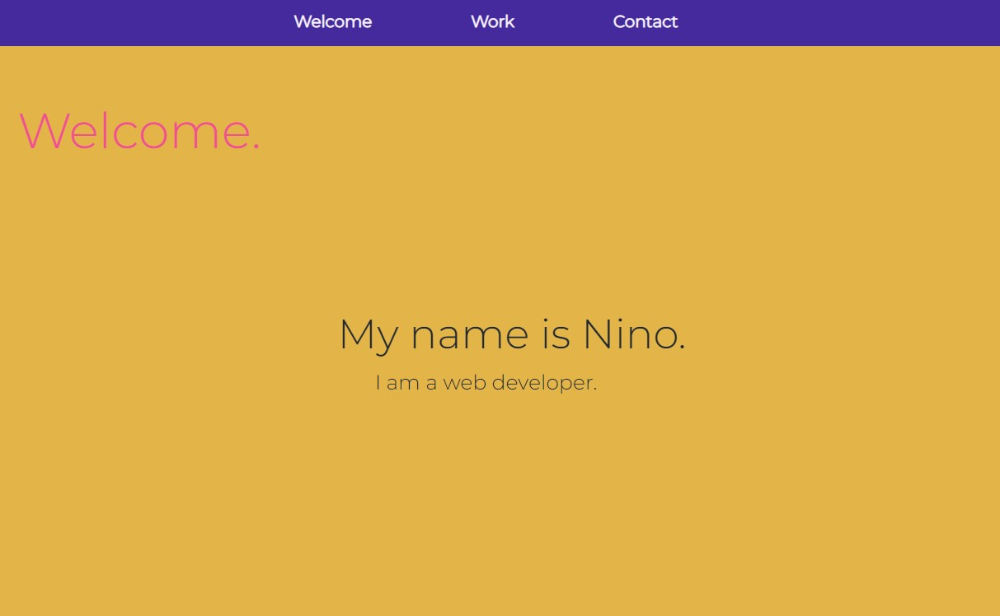

# Build a Personal Portfolio Webpage

This is a solution to the Build a Personal Portfolio Webpage - freecodecamp.org

## Table of contents

- [Overview](#overview)
  - [Screenshot](#screenshot)
  - [Links](#links)
  - [Built with](#built-with)
  - [Continued development](#continued-development)
- [Author](#author)

## Overview

### Screenshot

### Links

- Solution URL: [GitHub Repository](https://github.com/ninogogol/personal_portfolio_webpage)
- Live Site URL: [GitHub Page](https://ninogogol.github.io/personal_portfolio_webpage/)

### Built with

- Semantic HTML5 markup
- CSS custom properties

### Continued development
I want to build more projects to improve my coding skills.

- Linkedin - [Nino Gogoladze](https://www.linkedin.com/in/nino-gogoladze-80a075227/)

